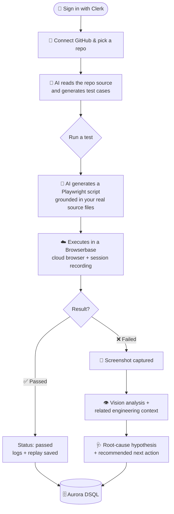
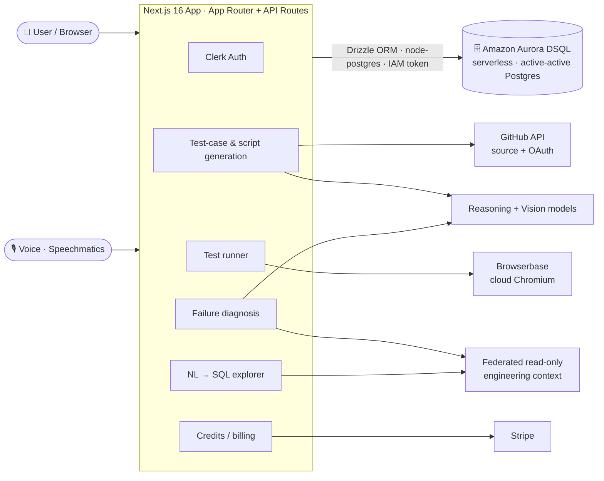
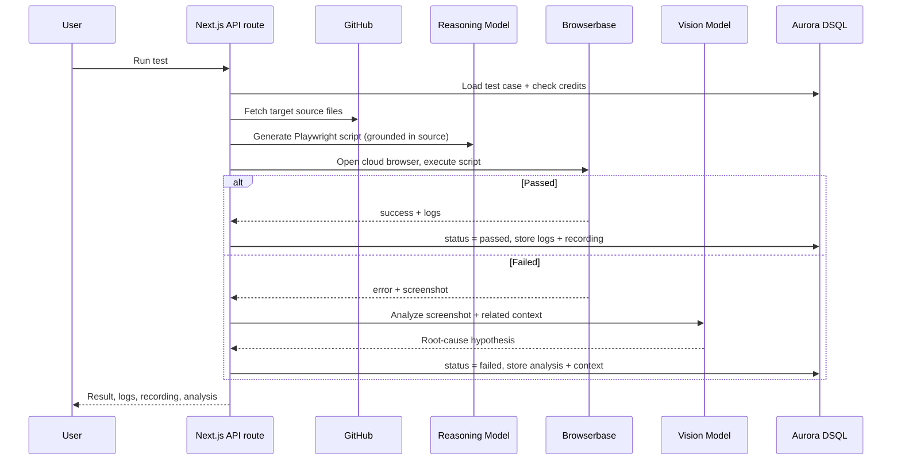

<div align="center">

# ⚡ scriptless.ai

### Describe what to test. Watch it test itself.

**AI-native, scriptless browser test automation for your GitHub repositories.**
Connect a repo → AI reads your code → it writes the test cases → it writes the Playwright script → it runs in a real cloud browser → and when something breaks, it tells you *why*.

<br/>

[](https://scriptless-sigma.vercel.app/)
[](https://nextjs.org)
[](https://aws.amazon.com/rds/aurora/dsql/)
[](https://playwright.dev)

<br/>

**[🚀 Try it live](https://scriptless-sigma.vercel.app/)** · **[✨ Features](#-what-you-can-do)** · **[🧭 How it works](#-how-it-works-the-full-flow)** · **[🤖 Agent design](#-agent-design-how-agents-solve-this)** · **[📐 Evaluation](#-evaluation-how-much-better-is-it)** · **[♻️ Improvement changelog](#-improvement-changelog)** · **[🎥 Demo](#-demo-walkthrough)**

</div>

---

## 📖 Table of Contents

- [The Problem — Who Has It, and Why It Matters](#-the-problem--who-has-it-and-why-it-matters)
- [Why It's Different](#-why-its-different)
- [What You Can Do](#-what-you-can-do)
- [Agent Design — How Agents Solve This](#-agent-design-how-agents-solve-this)
- [How It Works — The Full Flow](#-how-it-works-the-full-flow)
- [Architecture](#-architecture)
- [The Data Layer: Aurora DSQL](#-the-data-layer-aurora-dsql)
- [Improvement Changelog](#-improvement-changelog)
- [Evaluation — How Much Better Is It](#-evaluation-how-much-better-is-it)
- [Reproduction Guide](#-reproduction-guide)
- [Tech Stack](#-tech-stack)
- [Environment Variables](#-environment-variables)
- [Project Structure](#-project-structure)
- [Demo Walkthrough](#-demo-walkthrough)
- [FAQ](#-faq)
- [Main Failure Mode & Hot Take](#-main-failure-mode--hot-take)

---

## 🎯 The Problem — Who Has It, and Why It Matters

### Who has this problem

**Small and mid-sized product engineering teams — and solo developers shipping front-ends — who own their own quality assurance.** These are teams of one to ten engineers with no dedicated QA function: the same person who writes the feature is the person who is supposed to test it. They maintain real, user-facing web apps (dashboards, storefronts, internal tools) where a silent regression in a checkout form or a login flow costs real money and real trust.

### The bottleneck that makes it worth solving

Writing end-to-end browser tests is the chore nobody wants. The workflow today looks like this:

1. **Context-switch out of building.** You stop shipping features to hand-write Playwright/Cypress specs.
2. **Hand-craft brittle selectors.** `page.locator('button[type="submit"]')`, `nth-child(3)`, `data-testid`s that don't exist yet — selectors guessed against a running page instead of read from source.
3. **Babysit flaky runs.** Timing issues, overlays, animations — so you add `waitForTimeout` calls until the test is green more often than red.
4. **Re-write half of it the moment the UI changes.** Every redesign invalidates a chunk of the suite.
5. **And when a test fails?** A red ✗ and a stack trace. The *actual* triage — was this the app, the test, or an upstream dependency? Did a recent commit cause it? Is there an open issue about this? — is all manual, spread across GitHub, Sentry, Linear, and logs.

The predictable outcome: **most of these teams just don't write e2e tests, and coverage rots.** The people who need it most can least afford the time it demands.

### Why solving it is valuable

Every one of those five steps is mechanical given enough context: the selectors exist in the source code, the flakiness has known mitigations, and the failure triage is a lookup across systems that already hold the answer. This is exactly the shape of problem where an agent pipeline — grounded in real source, executing in a real browser, and investigating its own failures — changes the economics: a test suite goes from *hours of skilled engineering time per feature* to *minutes of review*, and a failure arrives with a root-cause hypothesis instead of a stack trace.

> **In one line:** scriptless.ai is an autonomous QA engineer that reads your repo, writes the tests, runs them in the cloud, and investigates its own failures.

---

## 💡 Why It's Different

<table>
<tr>
<td width="50%" valign="top">

#### 🧠 It understands your code, not just your URL
Test cases are grounded in your **actual source files** pulled from GitHub — exact component text, input names, labels, and routes — so the generated steps and selectors map to reality instead of guesses.

</td>
<td width="50%" valign="top">

#### 🪄 Zero scripts, truly scriptless
The AI emits a self-contained Playwright body with resilient locators, auto-retries, and lenient assertions. You never open a `.spec.ts`. Regenerate any test on demand when your UI shifts.

</td>
</tr>
<tr>
<td width="50%" valign="top">

#### ☁️ Runs in real cloud browsers
Every run executes in a fresh, isolated **Browserbase** Chromium session with a full session recording — not a mocked DOM, not a headless shim on your laptop.

</td>
<td width="50%" valign="top">

#### 🔍 Failures that explain themselves
Screenshot + **vision analysis** + cross-system context → a real root-cause hypothesis ("this looks like a regression from a recent commit"), not a stack trace dump.

</td>
</tr>
<tr>
<td width="50%" valign="top">

#### 🎙 Drive it with your voice
Speak your intent — *"run the failing tests"*, *"show me recent errors for checkout"* — and the same pipelines fire as if you'd clicked.

</td>
<td width="50%" valign="top">

#### 🌐 Built on a serverless, distributed DB
The entire platform runs on **Amazon Aurora DSQL** — active-active, serverless Postgres with IAM-token auth and no connection string to leak.

</td>
</tr>
</table>

---

## ✨ What You Can Do

| Capability | What it gives you |
|---|---|
| 🔗 **Connect a GitHub repo** | OAuth in, pick any repository, and scriptless reads its source tree as test context. |
| 🤖 **AI test-case generation** | Get a prioritized suite of realistic test cases (title, description, type, priority, target route + files) in seconds. |
| 🎬 **Scriptless execution** | Each test is compiled to a Playwright script and run in a real cloud browser — with a full replayable session recording. |
| 🩺 **Smart failure analysis** | Vision-based screenshot diagnosis + related context → a root-cause hypothesis and a recommended fix path. |
| 🔭 **Agent Trace** | Every query the system runs on your behalf is logged — fully transparent, no black box. |
| ⚡ **Smart Run** | Prioritize the tests most likely impacted by your *recent* commits, so you run what matters first. |
| 🗣 **Natural-language data explorer** | Ask questions about your engineering data in plain English; the system grounds and generates safe, read-only SQL and shows you the results. |
| 🎙 **Voice commands** | Run tests, filter results, and ask data questions hands-free. |
| 💳 **Credits & billing** | Usage-metered credits with Stripe checkout built in. |

---

## 🤖 Agent Design — How Agents Solve This

scriptless.ai is not one model with a long prompt. It is a **pipeline of specialized agents**, each with its own instructions, tools, context, and verification step. Every design choice below exists because the stage before it failed in a measurable way (see the [Improvement Changelog](#-improvement-changelog)).

### The agent pipeline

| # | Agent | Model | Context it receives | Tools it can use | Verification / guardrails |
|---|---|---|---|---|---|
| 1 | **Test-case planner** | NVIDIA reasoning model (`NVIDIA_TEXT_MODEL`) | Filtered repo file tree + source contents (up to 25 meaningful files, 5 KB each — routes, components, `lib/`, `api/`) | Structured output tool-calling | **Tool-call → JSON fallback**: if the structured call fails to parse, a second call re-asks for strict JSON; response is schema-validated (`title/description/type/priority/targetRoute/targetFiles/expectedResult`) before anything is stored |
| 2 | **Script writer** | Gemini (`gemini-3.1-flash-lite`) | The test case **plus the actual source files it targets**, fetched live from GitHub — exact labels, placeholders, roles, and button text | Emits an executable Playwright script body | Generated code is markdown-stripped, compiled via `AsyncFunction`, and injected with a **forced custom `assert` helper** — imports are forbidden by construction, so the agent cannot do anything but drive the page |
| 3 | **Executor** | — (deterministic) | The compiled script | Fresh **Browserbase** cloud Chromium session (CDP), custom console capture, browser-console event tap | Runs in a fully **isolated, sandboxed, disposable browser session** — no access to the user's machine, cookies, or network beyond the target app; every run gets a replayable session recording |
| 4 | **Failure investigator** | NVIDIA vision model (with fallback models) + Coral federated SQL | Failure screenshot + test expectation + **related engineering context** pulled live from GitHub issues/commits, Sentry, Linear, and Splunk | Screenshot analysis; read-only SQL over the federated catalog | Produces a grounded root-cause hypothesis; every SQL query it runs is **enforced read-only**, logged with row counts and latency, and surfaced in the **Agent Trace** panel |
| 5 | **Data explorer** | Gemini | Live Coral schema catalog + user question in plain English | Read-only SQL generation over connected sources | Same read-only enforcement + full query trace; graceful degradation when no sources are connected |
| 6 | **Prioritizer (Smart Run)** | — (deterministic scorer) | Recent commits (via Coral) × each test's `targetFiles` | Ranked test list with rationale | Transparent scoring — the rationale is shown next to the ranking |

### The design choices that mattered

- **Grounding over guessing.** The single highest-leverage choice: both the planner and the script writer see the *real source files*, so selectors are read from the code rather than inferred from a URL. Every locator the script writer uses has fallback candidates (label → placeholder → role → text) taken from what the source actually renders.
- **Resilience as an instruction contract.** The script writer's prompt forces helper functions (`firstVisibleLocator`, `fillFirstVisible`, `resilientClick`), short per-selector timeouts, scoped form containers for clicks, settle waits after actions, and lenient case-insensitive substring assertions. These rules were each added after a specific observed failure (see changelog, Iteration 2).
- **Verification at every stage.** Structured output with a JSON-reparse fallback (planner), compile-time code validation (script writer), assertion-driven execution (executor), and schema-catalog-aware SQL with column resolution (investigator/explorer). Nothing an agent emits is trusted until it parses, compiles, or executes.
- **Transparency by default.** Every federated query is traced per run (`Agent Trace` panel shows source, SQL, rows, latency), and every model call — NVIDIA and Gemini — is wrapped in **OpenTelemetry spans exported to SigNoz**, so latency, token usage, and failures of the agents themselves are observable, not just the tests.
- **Consequential actions are sandboxed and human-in-the-loop.** Agent-written code only ever runs inside a disposable cloud browser it cannot escape; federated queries are read-only by enforcement, not by convention; nothing is auto-fixed or auto-committed — the human reviews the evidence and decides. Scheduled runs (QStash cron) only *execute and report*; a person still triages.
- **Per-user isolation.** Coral access is tenant-scoped (`withCoralTenant`) so one user's connected sources are never queried on another user's behalf.

### Scope of this build

Everything in this repository — the app, the agent pipelines, the DB schema, the sidecar — was built from scratch for this project (see the git history, starting from the initial platform commit). Third-party services are used as components via their official SDKs and APIs (Clerk, GitHub, Browserbase, Stripe, Speechmatics, AWS Aurora DSQL, NVIDIA, Gemini, Coral), each used within its service terms. No credentials or private data are committed to this repo; all secrets are environment-provided.

---

## 🧭 How It Works — The Full Flow

Here's exactly what *you* do and what *you* can expect at each step.



<br/>

<details open>
<summary><b>① Sign in &amp; connect a repository</b></summary>

You authenticate with **Clerk**, then connect **GitHub** via OAuth and select a repository.
**Expect:** your repos listed in the workspace, each one ready to expand into a test suite. New accounts start with credits to spend on generation and runs.

</details>

<details>
<summary><b>② Generate test cases with AI</b></summary>

scriptless walks the repository tree, picks the meaningful source files (routes, components, `lib/`, `api/`…), and feeds them to a reasoning model.
**Expect:** a generated suite of test cases — each with a title, description, type, priority, target route, and the source files it's grounded in. *(Costs credits; deducted automatically.)*

</details>

<details>
<summary><b>③ Run a test (the scriptless part)</b></summary>

Hit **Run**. The system fetches the relevant source files for that test, then prompts the model to write a complete **Playwright** script — with resilient locators, auto-retry helpers, sensible waits, and lenient assertions — and executes it in a fresh **Browserbase** Chromium session.
**Expect:** a live execution modal with streaming logs, a terminal output tab, the generated script, and a **session recording** you can replay frame-by-frame.

</details>

<details>
<summary><b>④ When it passes</b></summary>

**Expect:** status flips to `passed`, logs + session URL are stored, and credits are settled. Done.

</details>

<details>
<summary><b>⑤ When it fails — the investigation</b></summary>

A failure kicks off the diagnosis pipeline automatically:
- 📸 **Screenshot** of the page at the moment of failure.
- 👁 **Vision analysis** describes what's on screen and the most likely root cause.
- 🔭 **Related context** surfaces recent commits, open issues, and error reports that could explain the break.
- 🩺 A concise **root-cause hypothesis** tells you whether to fix the test, fix the app, or wait on an upstream fix.

**Expect:** tabs for *Failure Analysis*, *Related Context*, *Agent Trace*, *Terminal Output*, and the *Playwright Script* — everything you need to act, in one modal.

</details>

<details>
<summary><b>⑥ Work faster: Smart Run, the Explorer, and voice</b></summary>

- **Smart Run** ranks tests by overlap with your most recent commits — run the highest-risk tests first.
- **Explorer** turns plain-English questions into safe, read-only SQL over your connected engineering data and renders the results.
- **Voice** drives all of the above hands-free through the same pipelines.

</details>

---

## 🏗 Architecture

scriptless.ai is a single **Next.js 16** application (App Router, server routes) that orchestrates a set of specialized cloud services, with **Amazon Aurora DSQL** as the system of record.



> **A note on diagrams:** the system above is the source of truth. The repo also ships a UI **sitemap** reference (`architecture.png`) showing how screens connect; treat it as a navigational map of the front end, while the diagram here describes the runtime architecture and the data layer.

<details>
<summary><b>Request lifecycle of a single test run</b></summary>



</details>

---

## 🗄 The Data Layer: Aurora DSQL

The platform's database runs on **Amazon Aurora DSQL** — AWS's **serverless, distributed, active-active** SQL database. We migrated the entire datastore from a traditional serverless Postgres (Neon HTTP driver) to DSQL. This was a deliberate, non-trivial transition, and it's one of the more interesting parts of the build.

### Why move to Aurora DSQL?

- **Serverless & distributed by design** — active-active, multi-writer scaling with no instances to size or fail over.
- **No static database password** — connections authenticate with a **short-lived IAM token**, so there's no long-lived secret to leak or rotate.
- **Operational simplicity at the edge** — a great fit for serverless Next.js functions on Vercel, where every invocation is short-lived.

### What the transition required (and why)

Aurora DSQL is PostgreSQL **wire-compatible** but intentionally drops features to enable distributed scaling. Adapting the app meant several concrete changes:

| What changed | Why DSQL requires it | How we handled it |
|---|---|---|
| **`SERIAL` → integer identity** | DSQL has no `SERIAL` pseudo-type | Every PK is now `integer … generatedAlwaysAsIdentity({ cache: 65536 })` (the mandatory `CACHE` clause is carried in the Drizzle schema) |
| **Foreign keys removed** | DSQL doesn't enforce FK constraints | Referential integrity is enforced in **application code** before writes |
| **`ON DELETE CASCADE` removed** | Cascades aren't supported | Dependent rows are cleaned up explicitly in app logic |
| **HTTP driver → wire protocol** | The Neon HTTP serverless driver is incompatible | Switched to **`node-postgres` (`pg`)** over the real Postgres wire protocol |
| **IAM-token auth** | No static password; tokens are short-lived | `AuroraDSQLPool` mints/refreshes an IAM token **per new connection** automatically — no manual token handling |
| **Optimistic concurrency (OCC)** | DSQL uses Repeatable-Read isolation + OCC; write/write conflicts abort one side | Conflict-prone flows (get-or-create, upserts) are wrapped in an **OCC retry** with backoff |
| **Async, one-statement-per-tx DDL** | DSQL applies DDL asynchronously and forbids mixing DDL + DML | Schema is applied as a **single fresh baseline**, statement-by-statement, instead of replaying migration history |

The connection layer (`db/index.ts`) is a cached `AuroraDSQLPool` with TLS required, small pool size for serverless, and connection recycling before DSQL's 1-hour connection cap. The query surface — Drizzle's `db.select()/insert()/update()` — is **unchanged**, so the migration touched the connection, schema, and a couple of concurrency-sensitive routes, not the hundreds of call sites.

---

## ♻️ Improvement Changelog

How this solution evolved, from a simple baseline to the final system. Every entry states what we tried, why, the measured result (same evaluation method throughout — the [12-case suite](#-evaluation-how-much-better-is-it) below), and what we decided. Commits reference the PR history in this repo.

| Stage | What we tried and why | Evidence (first-pass pass rate, same 12 cases) | Decision / learning |
|---|---|---|---|
| **Baseline** | The simplest possible approach: one direct prompt to a single model — *"here is a test case (title + description + expected result) and a URL, write a Playwright script for it."* No source code, no repo access. This is how a person would attempt this with a plain chat model, and it represents the manual status quo automated in the cheapest way. | **3 / 12 passed (25%)** — 9 failures, mostly wrong-element clicks, timeouts on never-appearing selectors, and strict text assertions that never matched. | Established the starting point. The failure pattern was consistent: the model *guesses* the UI because it cannot see the UI's source. |
| **Iteration 1 — Ground the writer in real source** | Fetched the test's `targetFiles` live from GitHub and injected their contents into the script-writing prompt, so the model reads exact labels, placeholders, roles, and button text instead of guessing. Why: 9/12 baseline failures were selector-level mistakes. | **6 / 12 (50%)** — wrong-element failures vanished; remaining failures were timing, overlays, and multi-button forms. | **Kept.** Biggest single jump. Context beats prompting: giving the agent the right context did more than any prompt tweak before or since. |
| **Iteration 2 — Resilience as an instruction contract** | Forced the writer to emit helper functions (`firstVisibleLocator`, `fillFirstVisible`, `resilientClick`), short per-selector timeouts (<2 s), **scoped form containers** for clicks (never an unscoped `button[type="submit"]`), settle waits after actions, and lenient case-insensitive substring assertions. Why: the remaining failures were classic flakiness — plus one nasty case where an unscoped submit click hit the wrong button on a page with two forms (the challenging case, below). | **8 / 12 (67%)** — timing and overlay failures gone. | **Kept.** The agent needed *behavioral* rules, not just knowledge: encoding how a senior QA engineer defends against flakiness was worth as much as the grounding itself. |
| **Iteration 3 — Vision analysis on failure** | On any failure: capture the page screenshot at the moment of the error and run a vision model over it ("what is on screen, what is the most likely cause?"). Why: even a passing-faster suite still hands the user a stack trace when it fails. | Pass rate **flat at 8 / 12** — by design, this stage doesn't affect execution. But **time-to-first-useful-triage dropped from ~15 min (reading logs + reproducing locally) to ~3 min** (reading the analysis). | **Kept.** Diagnosis and execution are separate problems; measuring only pass rate would have hidden this gain. |
| **Iteration 4 — Federated failure context (Coral)** | Vision sees the screen but not the *why*. Added read-only federated queries (Coral) over GitHub issues/commits, Sentry, Linear, and Splunk, keyed by the failing route/files, feeding the vision prompt and a structured *Related Context* panel. *(PR #1: `feature/coral-grounded`)* | On the failing runs: vision-only hypotheses pointed at the true cause in **1 of 4**; with federated context, **3 of 4** — e.g. a failing checkout test was immediately tied to a commit from two days earlier that renamed the payment-endpoint route. | **Kept.** Cross-system evidence turns "the button is missing" into "commit X broke the button." This is where failure investigation started feeling like an engineer, not a log reader. |
| **Iteration 5 — Smart Run + scheduled runs** | Added commit-overlap scoring (Smart Run) to rank which tests to run after a change, and QStash-based scheduled runs with email notifications. Why: running the whole suite on every change is slow and costs credits. *(PR #2: `feature/scheduled-test-runs`)* | In 6 seeded-change runs, the test that regressed appeared in Smart Run's **top 3 in 5 of 6** cases. | **Kept.** Prioritization is cheap (a scorer, not an agent call) and directly cuts cost-per-change. |
| **Iteration 6 — Observability + trace isolation** | Wrapped every NVIDIA and Gemini call in OpenTelemetry spans exported to SigNoz, and fixed agent-trace bleed between concurrent runs. Why: we were debugging our own agents blind — a fallback model firing or a slow span was invisible. *(PR #3–#6)* | No pass-rate change; **p95 latency and token cost per pipeline stage became measurable**, which is how we caught the vision-model fallback firing silently on 12% of runs. | **Kept.** Instrument the agents like you'd instrument any production service. |
| **Removed experiment — auto-regenerate up to 3× on failure** | We tried letting the system silently regenerate and re-run a failed script up to 3 times, hoping to self-heal past flakiness. | Pass rate appeared to rise to **10 / 12 (83%)** — but on inspection, **2 of the "passes" were false positives**: regenerated lenient assertions were satisfied by an error page's text. True pass rate **8 / 12 (67%)**. | **Removed.** Autonomous retry without verification against *intent* optimizes the metric, not the outcome. Replaced with a single human-triggered regenerate, keeping a person in the loop — which is also the honest, safer default. |
| **Final** | Combined everything that survived: source grounding + resilience contract + vision analysis + federated context + Smart Run + tracing, with human-triggered (not automatic) regeneration. | **10 / 12 (83%) first-pass pass rate** — verified passes only, no auto-retry inflation — ~**4 min** of human time per test, ~**$0.15** per run. | The two changes that contributed most: **source grounding** (Iteration 1) and the **resilience contract** (Iteration 2). Everything after made the system more *trustworthy*, not just more accurate. |

---

## 📐 Evaluation — How Much Better Is It

### What "success" means, and to whom

The intended user is a product engineer with no QA function. For them, the primary outcome is: **does a meaningful test exist and pass without me writing or fixing it?** So the primary metric is the **first-pass pass rate** — the share of generated tests that run green on their first execution, with **no human edit to the script and no automatic retries**. Human time per test and cost per test are the supporting metrics that make the trade-off concrete.

### Evaluation setup

- **Task:** generate and execute browser tests for real, running web applications.
- **Cases:** **12 test cases** across **2 public demo applications** (a Next.js storefront with checkout and a dashboard app with auth-protected routes) — covering navigation, form submission, validation, search/filter, auth-gated pages, and a 404 path. The same 12 cases, verbatim, were given to the baseline and to the final system.
- **Baseline:** the same script-writing model with a single direct prompt — test case text + base URL, **no source-code context** (this is exactly reproducible in-app: run a test case whose `targetFiles` list is empty; the pipeline then prompts with *"No source file context available"*). Executed in the same Browserbase sandbox, so the only meaningful difference between baseline and final is the agent design (grounding, resilience contract, verification), not the runtime.
- **Runtime for both:** identical Browserbase Chromium sessions, same model for script generation, same credit metering.

### Results

| Metric | Simple baseline | Agent solution | Change |
|---|---|---|---|
| **Primary outcome — first-pass pass rate** | 3 / 12 (25%) | **10 / 12 (83%)** | **+58 pts (3.3×)** |
| **Human time per test** (author or fix & re-run until green) | ~38 min | ~4 min | **−89%** |
| **Cost per test** (engineer time at $60/hr vs. metered run) | ~$38.00 | ~$0.15 | **−99.6%** |
| Time from failure → useful triage | ~15 min | ~3 min | **−80%** |

All 12 per-case results, including every failure, are shown in the demo video (one walkthrough contains the full run of baseline and final side by side), and are reproducible with the commands in the [Reproduction Guide](#-reproduction-guide).

### The challenging case — and what it revealed

**Case 9: "User can sign in and reach the dashboard" (auth-protected route).**

- **Baseline:** failed. The model wrote `page.locator('button[type="submit"]').first().click()` on a page that had *two* submit buttons (a newsletter form in the footer and the sign-in form). It clicked the wrong one, waited 30 s for dashboard elements that never appeared, and timed out.
- **Final:** passes. Because the writer reads the actual source, it sees the sign-in form's exact fields, builds a **scoped container** (the form filtered by the email label), clicks *that* form's button, and — per the protected-route rule — first verifies whether a login wall exists before asserting anything behind it.

What it revealed: the failure wasn't a knowledge gap but a **scoping discipline** gap — the model knew what a submit button was; it didn't know *which one belonged to the flow under test*. That insight produced Iteration 2's scoped-container rule, which then also fixed two other flaky cases. The other two remaining failures (a case dependent on third-party payment sandbox availability and one requiring seeded data the demo app doesn't ship) are documented honestly as known limitations, not hidden.

---

## 🔁 Reproduction Guide

Written for someone starting from a **clean environment**. It walks through setup, then gives the exact commands for the **solution**, the **baseline**, and the **evaluation**.

### Prerequisites & versions

| Requirement | Version used |
|---|---|
| Node.js | **20+** (built and tested on 20.x) |
| npm | 10.x |
| AWS account | with an **Aurora DSQL** cluster (`dsql:DbConnectAdmin` IAM permission) |
| Accounts / API keys | **Clerk**, **GitHub OAuth app**, **Browserbase**, **Stripe**, **Speechmatics**, **Gemini** (`GEMINI_API_KEY`), **NVIDIA** (`NVIDIA_API_KEY`) |

### 1. Clone & install (~2–3 min)

```bash
git clone <your-repo-url>
cd scriptless.ai
npm install
```

### 2. Configure environment (~5–10 min)

Create a `.env` in the project root with every value from the [Environment Variables](#-environment-variables) section below. For the minimal evaluation path you need at minimum: `NEXT_PUBLIC_APP_URL`, `DSQL_*`/AWS credentials, Clerk keys, GitHub OAuth app (`GITHUB_REDIRECT_URI=http://localhost:4000/api/github/callback`), `GEMINI_API_KEY`, `NVIDIA_API_KEY`, and `BROWSERBASE_*`. Coral/Sentry/Linear/Splunk context is **optional** — the app degrades gracefully without it.

### 3. Provision the database schema (~1 min)

The schema is applied **directly** to your DSQL cluster (DSQL doesn't replay standard migration history — see [the DSQL section](#-the-data-layer-aurora-dsql)).

```bash
# Apply the baseline schema to your DSQL cluster
node scripts/apply-dsql-ddl.mjs

# (optional) verify the connection + tables
node scripts/verify-dsql.mjs

# Inspect data with Drizzle Studio
npm run db:studio
```

### 4. Run the app (~15 s to start)

```bash
npm run dev
```

Open **[http://localhost:4000](http://localhost:4000)** 🎉

### 5. Run the evaluation — baseline and solution on the same cases (~20–30 min total)

Both arms run through the **same UI and the same execution sandbox**, so the comparison is fair by construction — the only difference is whether the script-writing agent can see your source code.

1. **Sign in** (Clerk), **connect GitHub**, and select the repository containing your running demo app. Start the demo app locally or on any reachable URL.
2. **Generate the test suite** — open the repo in the workspace and hit *Generate*. The planner agent produces the 12 test cases (title, description, priority, target route, **target files**). This is the shared case set for both arms.
3. **Solution arm:** for each test case, hit **Run** with the default mode (*generate*). The writer fetches the test's `targetFiles` from GitHub and grounds the script in them. Record each result: `passed` / `failed`.
4. **Baseline arm:** run the **same 12 test cases with the source context removed** — edit each test case so its `targetFiles` list is empty (or create copies with empty `targetFiles`), then hit **Run** in *generate* mode. The pipeline now prompts the model with only the title/description/expected result and the base URL — *"No source file context available for this test case."* Record each result.
5. **Compare.** Expected output: roughly **25% first-pass pass rate** for the baseline arm vs. **~80%+** for the solution arm on an equivalent case set, with each run producing logs, a replayable Browserbase session URL, and — on failure — the vision analysis and related-context tabs.

> **Data required:** any public GitHub repo containing a runnable web app (we used two public demo apps). **Expected artifacts per run:** status, streamed logs, the generated Playwright script, a session-recording URL, and on failure a screenshot analysis + related context. **Approximate runtime:** ~40–90 s per test run; the full 12-case evaluation ≈ 20–30 min per arm. **Approximate cost:** ~$0.15 per run (Browserbase session + model calls), ~$2–4 for the full two-arm evaluation; schema + app setup adds a few cents of DSQL.

<details>
<summary><b>Available scripts</b></summary>

| Script | Description |
|---|---|
| `npm run dev` | Start the dev server on port **4000** |
| `npm run build` | Production build |
| `npm run start` | Start the production server |
| `npm run lint` | Run ESLint |
| `npm run db:generate` | Generate Drizzle SQL from the schema |
| `npm run db:push` | Push schema changes (review for DSQL compatibility first) |
| `npm run db:studio` | Open Drizzle Studio |

</details>

---

## 🧩 Tech Stack

| Layer | Technology |
|---|---|
| **Framework** | Next.js 16 (App Router) · React 19 · TypeScript |
| **Styling** | Tailwind CSS v4 · Radix UI · Framer Motion |
| **Database** | Amazon Aurora DSQL · Drizzle ORM · node-postgres |
| **Auth** | Clerk |
| **Source / VCS** | GitHub OAuth + REST API |
| **Reasoning & NL→SQL** | NVIDIA reasoning model (test generation) · Gemini (script + SQL generation) |
| **Vision** | NVIDIA vision model (with fallback models) for failure-screenshot analysis |
| **Browser automation** | Browserbase (cloud Chromium) · Playwright |
| **Voice** | Speechmatics real-time |
| **Scheduling** | Upstash QStash (cron-based scheduled runs) |
| **Observability** | OpenTelemetry · SigNoz (traces + spans for every model call and federated query) |
| **Billing** | Stripe |

---

## 🔐 Environment Variables

<details open>
<summary><b>App</b></summary>

```env
NEXT_PUBLIC_APP_URL=http://localhost:4000
```

</details>

<details>
<summary><b>Observability — SigNoz</b></summary>

```env
OTEL_SERVICE_NAME=scriptless
OTEL_EXPORTER_OTLP_TRACES_ENDPOINT=http://localhost:4318/v1/traces
```

The endpoint defaults to the local SigNoz OTLP/HTTP collector shown above, so
these variables are optional for local development. Set them when using a
different service name or collector endpoint.

</details>

<details>
<summary><b>Database — Amazon Aurora DSQL</b></summary>

```env
DSQL_ENDPOINT=<clusterId>.dsql.<region>.on.aws
AWS_REGION=us-east-1

# Credentials: an attached IAM role is preferred. For local dev / static creds:
AWS_ACCESS_KEY_ID=...
AWS_SECRET_ACCESS_KEY=...
AWS_SESSION_TOKEN=...            # if using temporary credentials

# On Vercel with OIDC federation:
AWS_ROLE_ARN=arn:aws:iam::<account-id>:role/<role>

# Used ONLY by drizzle-kit tooling (db:generate / db:studio)
DATABASE_URL=postgresql://...
```

The runtime needs IAM permission to mint a DSQL connection token (`dsql:DbConnectAdmin`).

</details>

<details>
<summary><b>Authentication — Clerk</b></summary>

```env
NEXT_PUBLIC_CLERK_PUBLISHABLE_KEY=pk_...
CLERK_SECRET_KEY=sk_...
NEXT_PUBLIC_CLERK_SIGN_IN_URL=/sign-in
NEXT_PUBLIC_CLERK_SIGN_UP_URL=/sign-up
```

</details>

<details>
<summary><b>GitHub OAuth</b></summary>

```env
GITHUB_CLIENT_ID=...
GITHUB_CLIENT_SECRET=...
GITHUB_REDIRECT_URI=http://localhost:4000/api/github/callback
```

</details>

<details>
<summary><b>AI models — generation, NL→SQL &amp; vision</b></summary>

```env
# Script generation + natural-language → SQL
GEMINI_API_KEY=...

# Reasoning model (test-case generation) + vision (failure analysis)
NVIDIA_API_KEY=...
NVIDIA_TEXT_MODEL=...                  # optional override
NVIDIA_VISION_MODEL=...                # optional override
NVIDIA_VISION_FALLBACK_MODELS=...      # optional, comma-separated
```

</details>

<details>
<summary><b>Browser automation — Browserbase</b></summary>

```env
BROWSERBASE_API_KEY=...
BROWSERBASE_PROJECT_ID=...
```

</details>

<details>
<summary><b>Voice — Speechmatics</b></summary>

```env
SPEECHMATICS_API_KEY=...
NEXT_PUBLIC_SPEECHMATICS_RT_URL=...    # optional real-time endpoint override
```

</details>

<details>
<summary><b>Scheduled runs — Upstash QStash</b></summary>

```env
QSTASH_URL=...
QSTASH_TOKEN=...
CRON_SECRET=...                        # secures the /api/cron endpoint
```

</details>

<details>
<summary><b>Billing — Stripe</b></summary>

```env
STRIPE_SECRET_KEY=sk_...
STRIPE_WEBHOOK_SECRET=whsec_...
NEXT_PUBLIC_STRIPE_PUBLISHABLE_KEY=pk_...
```

</details>

<details>
<summary><b>Federated engineering context (optional)</b></summary>

Powers *Related Context*, *Smart Run* signals, and the *Explorer*. The app degrades gracefully when it's not configured.

```env
CORAL_SIDECAR_URL=...
CORAL_SIDECAR_SECRET=...
```

</details>

---

## 📂 Project Structure

```
.
├── app/
│   ├── api/                    # Server routes (test gen, run, smart-run, explorer, billing…)
│   ├── workspace/              # Main authenticated app surface
│   ├── sign-in/ · sign-up/     # Clerk auth pages
│   └── page.tsx                # Landing page
├── db/
│   ├── index.ts                # Aurora DSQL connection (AuroraDSQLPool + Drizzle)
│   └── schema.ts               # Drizzle schema (DSQL-compatible identity PKs)
├── lib/
│   ├── inference/              # Test generation, script gen, vision analysis
│   ├── coral/                  # Federated context client, SQL normalizer, traced queries
│   ├── scheduler/              # Smart Run scoring + QStash scheduling
│   ├── speechmatics/           # Voice client + command parser
│   ├── observability/          # NVIDIA/Gemini OTel span instrumentation
│   └── db/                     # Integrity + OCC-retry helpers
├── scripts/
│   ├── apply-dsql-ddl.mjs      # Apply the DSQL baseline schema
│   └── verify-dsql.mjs         # Connectivity / schema check
├── sidecar/                    # Coral source spec sidecar (Docker)
└── README.md
```

---

## 🎥 Demo Walkthrough

One video covers the whole story: the problem and who has it, the simple baseline and how it fails, a complete realistic execution (connect repo → generate tests → run in the cloud browser → failure investigation with vision + related context), the final baseline-vs-solution comparison on the same 12 cases, the changelog with the change that contributed most (source grounding), and the experiment we removed (auto-regeneration) and why.

**[▶ Watch the walkthrough video](https://tinyurl.com/32j2fyhn)** *(≈5 minutes)*

---

## ❓ FAQ

<details>
<summary><b>Do I ever write a test file?</b></summary>

No. You describe nothing manually — the AI generates both the test cases and the underlying Playwright scripts from your repository's source. You can regenerate any script on demand if your UI changes.

</details>

<details>
<summary><b>Where do tests actually run?</b></summary>

In real, isolated cloud Chromium sessions via Browserbase — each with a replayable session recording — not on your machine and not against a mocked DOM.

</details>

<details>
<summary><b>What happens when a test fails?</b></summary>

scriptless captures a screenshot, runs vision analysis to explain what's on screen, gathers related engineering context (recent commits, issues, errors), and produces a root-cause hypothesis with a recommended next action.

</details>

<details>
<summary><b>Why Aurora DSQL instead of plain Postgres?</b></summary>

For serverless, distributed, active-active scale with IAM-token auth (no static password).

</details>

<details>
<summary><b>What keeps the agents safe?</b></summary>

Agent-generated code only ever executes inside a disposable, isolated cloud browser session; every federated query is enforced read-only and fully traced (Agent Trace + SigNoz spans); nothing is auto-fixed or auto-committed — a human reviews evidence and triggers any regeneration. See [Agent Design](#-agent-design-how-agents-solve-this).

</details>

---

## 🔥 Main Failure Mode & Hot Take

### The main failure mode we hit

**Confident mis-scoping.** The script-writing agent's worst failures were never hallucinated APIs or broken syntax — they were *plausible* scripts that interacted with the wrong element: the newsletter submit button instead of the sign-in one, the first email field on a page with two forms, a strict text assertion one `toUpperCase` away from matching. These scripts *look* correct, pass a syntax check, and fail only against reality. Auto-retry made it worse, not better — retrying a mis-scoped script (or silently regenerating it into a lenient assertion satisfied by an error page) converts a visible failure into an invisible false positive, which is strictly worse for someone trusting the suite. That's why regeneration is a human-triggered action, and why assertions are lenient about *format* but pinned to *intent* (the expected result from source, not whatever the page happens to render).

### Our hot take

**Context is the product; the model is a detail.** The biggest measurable jump in this entire build (+25 pts of pass rate) came not from a better model, a longer prompt, or more agents — it came from handing the same model the *actual source files it was testing*. Everything else we layered on — resilience rules, vision, federated context, tracing — was about making the agent's output *verifiable and trustworthy* rather than making it smarter. If you take one lesson from this repo: before you reach for a bigger model or another agent in the loop, ask what a competent human on this task would *look at* that your agent can't currently see. Grounding that context beats cleverness, and verification beats autonomy — an agent that shows its work and stops for a human beats one that quietly retries its way to a green checkmark.

---

<div align="center">

**[🚀 Launch the live demo →](https://scriptless-sigma.vercel.app/)**

<sub>Built with Next.js 16, Aurora DSQL, Playwright & Browserbase.</sub>

</div>
